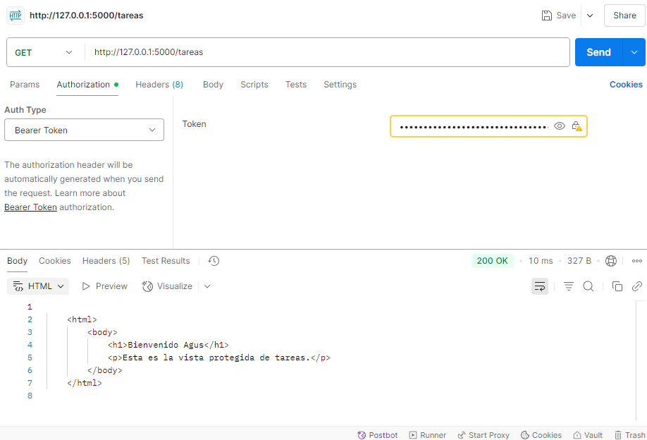

#  Sistema de Gestión de Tareas con API REST y Autenticación JWT

Trabajo práctico – PFO 2  
Tecnicatura en Desarrollo de Software - IFTS N° 29

Este proyecto implementa una API REST con Flask para gestionar usuarios y simular un sistema de tareas. Las contraseñas de los usuarios se almacenan de forma segura utilizando bcrypt (hashing), y la autenticación se realiza mediante JSON Web Tokens (JWT) para proteger el acceso a ciertas rutas.

---

##  Funcionalidades

- Registro de usuarios con contraseña hasheada
- Inicio de sesión que devuelve un token JWT
- Acceso protegido a tareas solo con token válido
- Base de datos persistente con SQLite
- Cliente de consola para interactuar con la API

---

## Tecnologías utilizadas

- Python 3
- Flask
- Flask-SQLAlchemy
- Flask-Bcrypt
- Flask-JWT-Extended
- SQLite
- Cliente con `requests` (consola)

---

## Instrucciones de uso

### 1. Clonar el repositorio

```bash
git clone https://github.com/foly13/PFO2-Redes.git
cd api-con-jwt
```

### 2. Crear entorno virtual e instalar dependencias

```bash

python -m venv venv
venv\Scripts\activate   # Activar entorno En Windows
venv/bin/activate  # En Linux/macOS

pip install flask flask_sqlalchemy flask_bcrypt flask-jwt-extended requests

```

### 3. Ejecutar el servidor
```bash
python servidor_jwt.py
```

El servidor se ejecutará en:
http://127.0.0.1:5000

### 4. Ejecutar el cliente de consola
En otra terminal:
```bash
python cliente_jwt.py
```

Cliente de Consola – Opciones disponibles
1. Registrar usuario
2. Iniciar sesión
3. Ver tareas (requiere token)
0. Salir

El cliente guarda el token JWT al iniciar sesión y lo utiliza automáticamente al acceder a tareas.

## Pruebas en Postman
A continuación se muestra una captura de una prueba exitosa realizada en Postman, donde se accede al endpoint protegido /tareas utilizando un token JWT válido.


> Nota: Este proyecto es una API REST construida con Flask (Python). GitHub Pages no permite alojar y ejecutar código de servidor, por lo que no es posible desplegar esta API allí.

